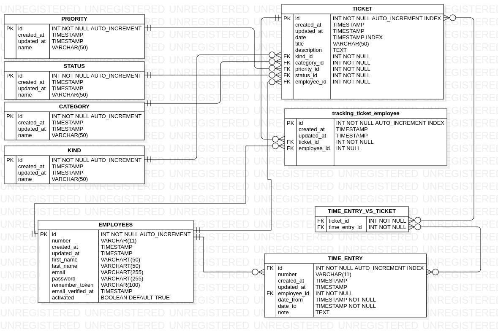

# Ticket System Api

**Description:**

It is a basic system in which an employee logs in, can create, update and delete tickets, can create an employee, and then can generate a report to obtain the hours worked.

- **Login**
- **Create a ticket**
- **Create employees:**
- **Create Time entries:**
- **Reports(Worked):**
- **Create a ticket**


**ER Diagram**



**Install Prerequisites:**

- **[GIT](https://git-scm.com/downloads)**
- **[Docker](https://docs.docker.com/engine/install/)**
- **[Docker Compose](https://docs.docker.com/compose/install/)**

Check if `docker-compose` is already installed by entering the following command :

```bash
$ which docker-compose
```

Check Docker Compose compatibility :

[Compose file version 3 reference](https://docs.docker.com/compose/compose-file/)

The following is optional but makes life more enjoyable:

```bash
$ which make
```

On Ubuntu and Debian these are available in the meta-package build-essential. On other distributions, you may need to install the GNU C++ compiler separately.

```bash
$ sudo apt install build-essential
```

**Images to use**

- [Nginx](https://hub.docker.com/_/nginx/)
- [MariaDB](https://mariadb.org/download/?t=mariadb&p=mariadb&r=10.6.5&os=Linux&cpu=x86_64&pkg=tar_gz&i=systemd&m=osuosl)
- [PHP-FPM](https://hub.docker.com/r/nanoninja/php-fpm/)
- [Composer](https://hub.docker.com/_/composer/)

You should be careful when installing third party web servers such as MySQL or Nginx.

This project use the following ports :

| Tech     |          Port |
|----------|--------------:|
| MariaDB  |          3306 |
| Nginx    |          8000 |

**Technology**

The ticketing system API uses laravel which provides a full-featured environment for large-scale, maintainable applications.

- (Laravel) is a framework that allows the use of an elegant and expressive syntax to create code in a simple way and allowing a multitude of functionalities. It tries to take advantage of the best of other frameworks and take advantage of the features of the latest versions of PHP.

**Usage:**

The api system has a default user which is `email: admin@admin password: admin1234`
Api documentation enter here please: [**Documentation**](https://documenter.getpostman.com/view/3381918/UVXqFt81)

**Installation:**

  **1- Clone:**

```bash
$ git clone https://github.com/Darknet17/ticket-system-api
```

2- **We access the bash folder:**

```bash
$ cd ticket-system-app
```

3-  **Add your file** `.env` **:**

```bash
$ cp env.example .env
```

The .env.example file has the following basic configurations:

```bash
DB_CONNECTION=mysql
DB_HOST=db
DB_PORT=3306
DB_DATABASE=db_api_tickets
DB_USERNAME=root
DB_PASSWORD=root
```

4- **Run this command to run it in docker:**

```bash
$ docker-compose build
$ docker-compose up -d
$ docker-compose exec app php composer install # load php migration
$ docker-compose exec app php artisan key:generate
$ docker-compose exec app php artisan --seed # load php migration
```

# 🎉 Ready  🎉
